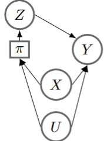

# spycause

A module for spatial causal inference in Python.
Docs are forthcoming.

For the Python package used to run the simulation experiments in Hoffman and Kedron (2023), please see [`spycause-experiments`](https://github.com/tdhoffman/spycause-experiments).

The regression adjustments provided here address data settings with the following graph structure:

where $\pi(x, u) = P(Z = 1 \mid X = x, U = u)$ is the propensity score, $X$ is a set of observed confounders, and $U$ stands for all unobserved spatial confounders.
$\pi$ is placed in a square node to indicate that it is not a random variable, and rather a deterministic function of random variables $X$ and $U$.
We also provide adjustments to correct for spatial interference between locations (not depicted).

## Features
- Simulation code for spatially confounded or interfered data
- Bayesian estimation routines (using Stan) for ordinary linear regression (OLS), conditional autoregressive models (CAR), and joint models for propensity score and outcome
- Adjustments for spatial interference
- Spatial and nonspatial first-stage propensity score estimation (also using Stan)
